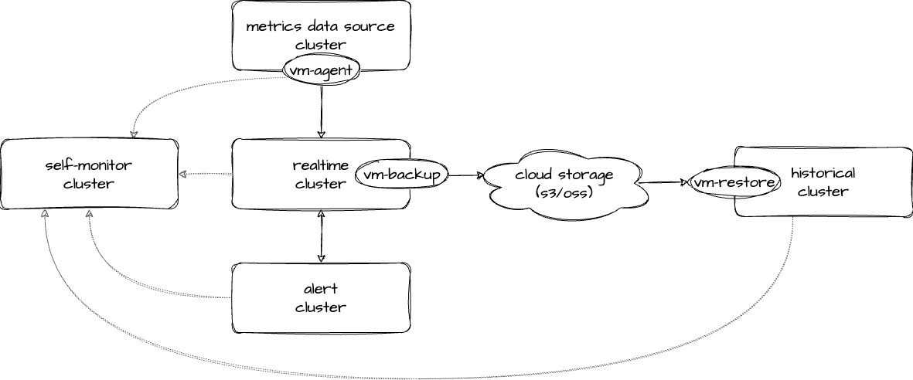
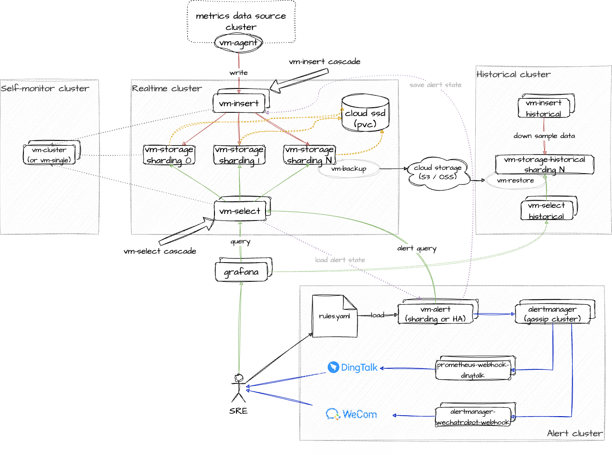
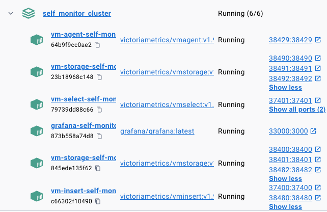
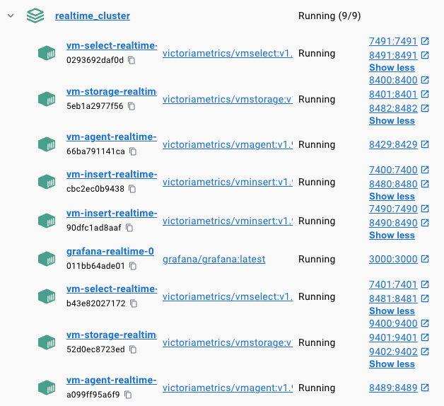
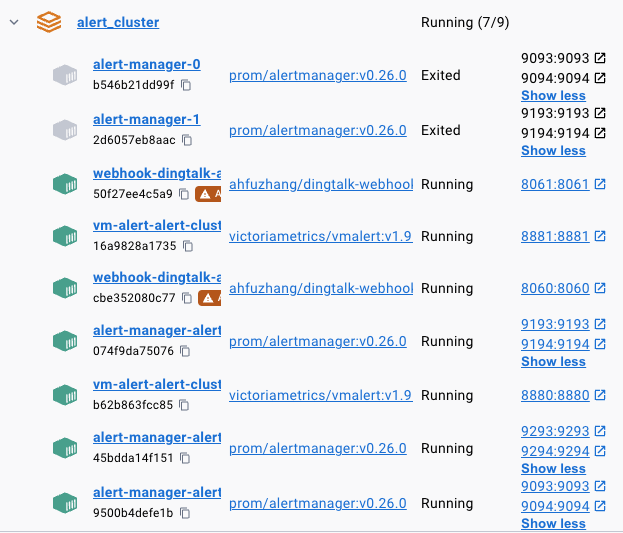
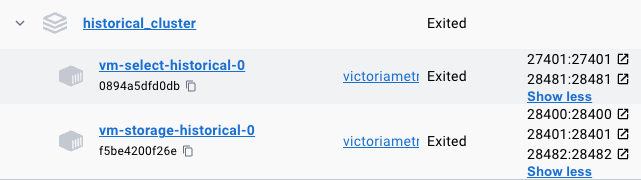

# deploy_VictoriaMetrics_cluster
Provides various scripts for deploying VistoriaMetrics cluster.


Although there are many ways to deploy VictoriaMetrics clusters, such as the official [operator](https://github.com/VictoriaMetrics/operator) and [helm-charts](https://github.com/VictoriaMetrics/helm-charts). This code repository first provides a complete cluster that can be started with one `make deploy` on a mac, and secondly provides a best practice for deployment architecture.

## Arch


([drawio link](https://drive.google.com/file/d/1QeSYKjv_fyaESiJPTSZLGU3O0G2gVrT3/view?usp=sharing))

A complete metrics system consists of four sub-clusters. They are:
  1. **Metrics data source cluster**: Register each exporter that needs to be reported and address it. Finally, the vm-agent component will capture the metrics data and then send it to the realtime cluster.
  2. **Realtime cluster**: Responsible for saving the metrics data of the last n days.
  3. **Historical cluster**: Responsible for downloading the backup data of the realtime cluster to the new node and providing long-term metrics data query.
  4. **Alert-cluster**: Responsible for executing alarm query and recording rules execution. After triggering the alarm, it integrates components such as alertmanager, and finally pushes the alarm to people who need to pay attention to the service through webhook and other methods.
  5. **Self-monitor cluster**: Collect the metrics data of the above four clusters and monitor the health of the metrics system itself.

## Details



([drawio link](https://drive.google.com/file/d/1vK99nejzfi8NWoQhE1n9ysWdw4-NQju9/view?usp=sharing))

## How to use
```shell
git clone https://github.com/ahfuzhang/deploy_VictoriaMetrics_cluster.git
cd deploy_VictoriaMetrics_cluster/docker_compose
make deploy  # deploy self-monitor, realtime, alert

# wait a moment to generate data
# set aws s3 env
# export AWS_ACCESS_KEY_ID=xxx
# export AWS_SECRET_ACCESS_KEY=xxx
# export AWS_REGION=xxx
# export AWS_BUCKET=xxx
# or write a .env file at backup/restore dir
make backup   # backup to s3
make restore  # restore from s3
make historical-cluster  # start historical cluster
```
You will see those items on docker-desktop:




